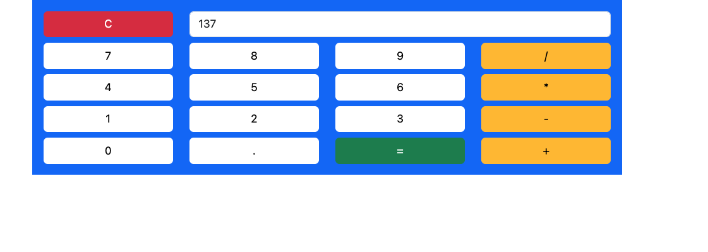

# Calculadora Angular

Este é um projeto de calculadora simples desenvolvido com Angular 17 e Bootstrap 5. O objetivo deste projeto é praticar o uso do Angular e aplicar estilos responsivos com Bootstrap.

## Demonstração



## Funcionalidades

- Realiza operações básicas: adição, subtração, multiplicação e divisão.
- Interface responsiva e amigável.
- Limpeza do visor com o botão "C".

## Tecnologias Utilizadas

- **Angular 17**: Framework para construção de aplicações web.
- **Bootstrap 5**: Framework CSS para estilização e layout responsivo.

## Instalação

Para executar este projeto localmente, siga os passos abaixo:

1. **Clone o repositório**:

   ```bash
   git clone https://github.com/seu-usuario/nome-do-repositorio.git
   ```

2. **Navegue até o diretório do projeto**:

   ```bash
   cd nome-do-repositorio
   ```

3. **Instale as dependências**:

   ```bash
   npm install
   ```

4. **Inicie o servidor de desenvolvimento**:

   ```bash
   ng serve
   ```

5. **Acesse a aplicação**:

   Abra seu navegador e vá para `http://localhost:4200`.

## Como Usar

- Clique nos números e operadores para realizar cálculos.
- Use o botão "C" para limpar o visor.
- Pressione "=" para ver o resultado da operação.

## Contribuições

Contribuições são bem-vindas! Sinta-se à vontade para abrir uma issue ou enviar um pull request.

## Licença

Este projeto está licenciado sob a [MIT License](LICENSE).
